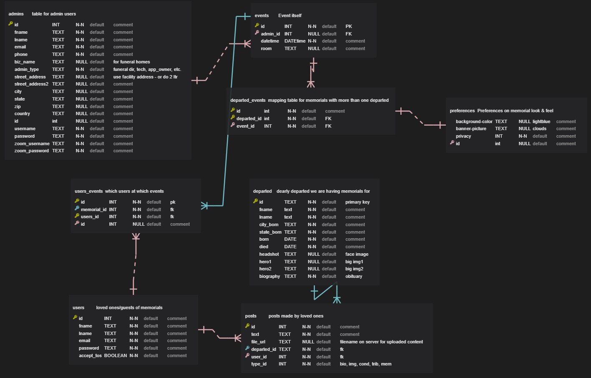
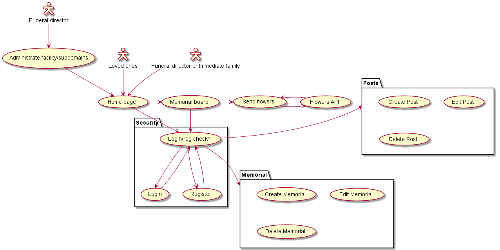

# RememberTogether
A memorial website-building and Flower shop web app for funeral directors and grieving families.  It is deployed through Heroku with it's PostgreSQL database hosted on ElephantSQL.  
You can visit the working copy on the URL https://www.virtual-memorials.net.  

The business concept is to offer it free to funeral directors and individuals.  Profit would be through the flower-shop portion of the app.  

## REST API Integration
The API I have chosen to work with is FloristOne.  They are rated 4+ stars and are very reliable vendors.  It is a JSON API with good documentation at https://florist.one/api/documentation/.  This API connects the user to their entire database of flowers searchable by name, style, event type, etc.  It includes prices, shipping calculations and also integrates with auth.net so users can actually order flowers to be drop shipped.  It is functional now up to cart creation in a sandbox environment.

## Database schema
Following is the database schema in crows foot notation. [database schema](virtual-memorial_schema1.jpg)

## User Flow
The general user flow involves loggin in or creating an account.  Then the user can either visit or create a memorial.  Already-created memorials can be accessed through a search box made with jQuery-UI. This functionality also uses an internal REST API using JSON to communicate between the front and back end.

Once navigating within a memorial a user can also read or add testimonials/memories of their passed friends or family members. It also includes the ability to upload pictures.  However because this is a demonstration app hosted on Heroku, Heroku will not retain those photos. With a paid subscription it will. The individual who added the testimonial can also modify or delete it.

At any point a user may browse, cart and buy flowers at the integrated flower shop through any of several links.  Sandboxed merchant services are included through FloristOne and auth.net.

Following is a UML use case diagram for an overview:  (RememberTogether-useCases.png)

## Overall Design & Use cases
This is a Flask/Postgres app using WTForms for validation, SQLAlchemy, Bootstrap and jQuery.  

Funeral directors can work with me to white-label it and add their own logo, etc. and offer it to their clients as an easy way to make a beautiful and easy memorial website.  All they have to do is fill out a form and upload the pictures they would like.  They can then send the link to friends and family so others can add pictures and share memories as well.

